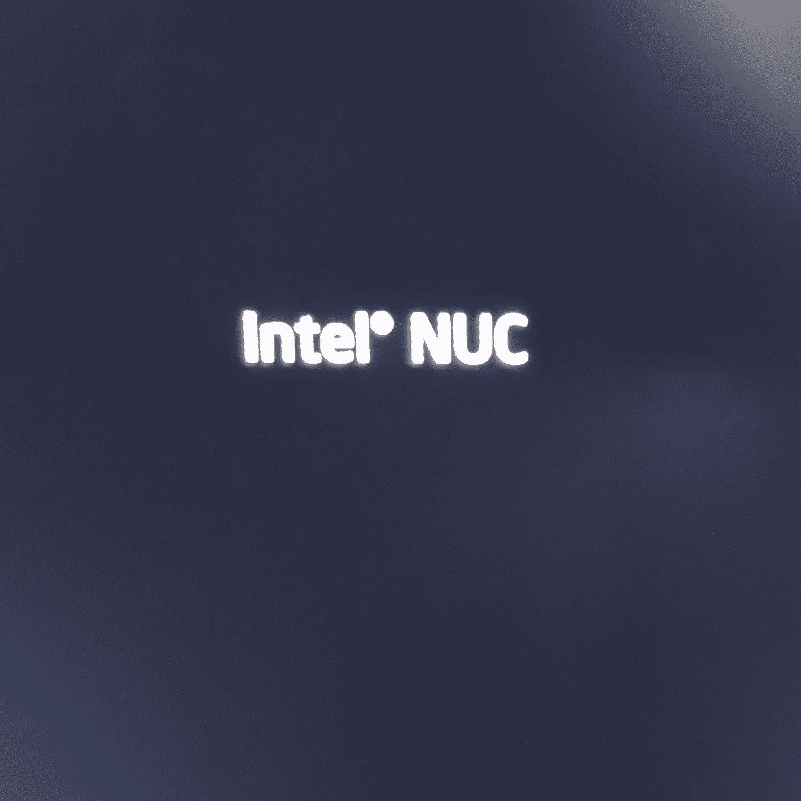
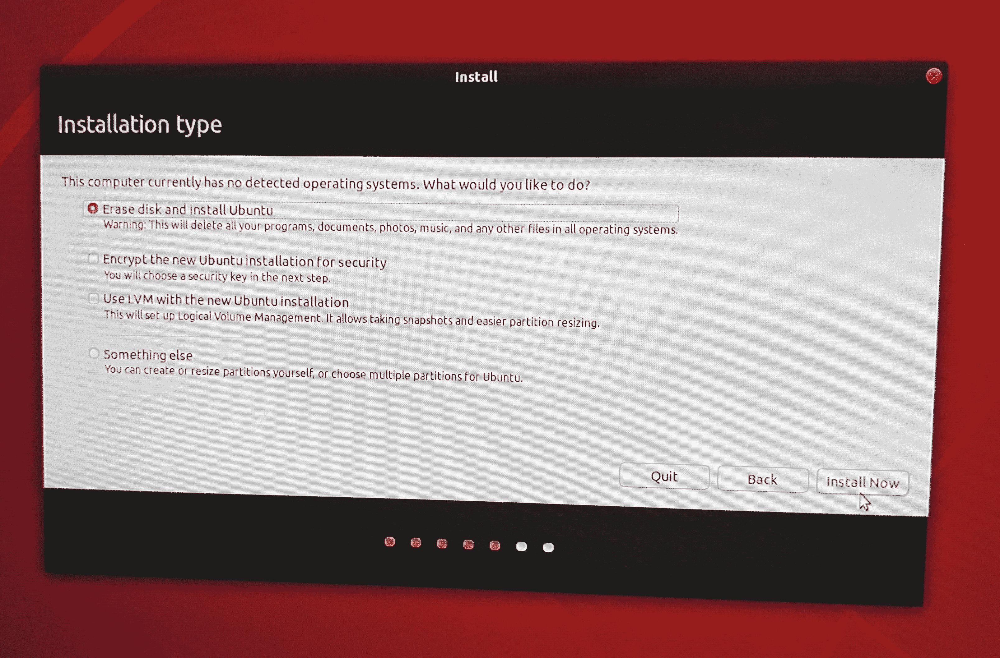
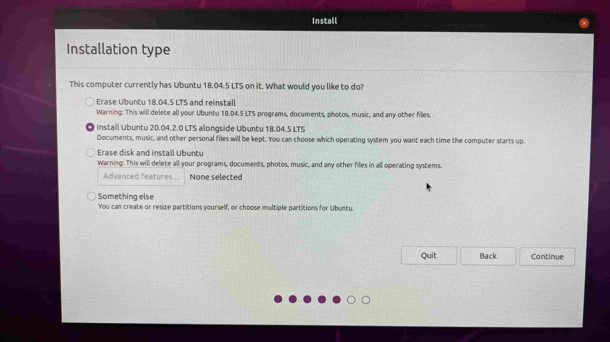

# Ubuntu 20.04 Installation

This guide describes how to perform an OS installation of Ubuntu 20.04 LTS onto Stretch.

## Ubuntu Image

Download the 20.04.4 amd64 Ubuntu desktop image by clicking this link:

https://releases.ubuntu.com/20.04/ubuntu-20.04.4-desktop-amd64.iso

Create a bootable drive with this Ubuntu image. There are many ways to do this, but the recommended way is to use [Etcher](https://www.balena.io/etcher/) on your personal machine. Open the Etcher software and follow it's instructions to create the bootable drive.

## Installation

Insert a bootable drive into the USB hub in the robot's trunk, as well as a monitor and keyboard. Next, power on the robot and at the bios startup screen (shown below) press *F10* when prompted to enter the boot menu.

From the boot menu, select 'OS BOOTLOADER' or look for a similar option that mentions "USB", "LIVE INSTALLATION", or "UBUNTU".

From here, the monitor should show the grub bootloader and display a menu similar to what is shown below:

From this menu select 'Ubuntu'. A disk errors checker will start and then the Ubuntu 20.04 installer will be launched.

At the first screen you will be prompted to select a language for the system. Select 'English' as shown below and click on the "Install Ubuntu".

Next you will be prompted to select a keyboard layout. Select 'English(US)'.

The next page will show a menu to select a Wifi network if you are not already connected.

It is suggested to use a wired connection if possible for a faster install; your connection status should be visible in the top right of the display.

On the next page titled, 'Updates and other software', select 'Minimal Installation' under 'What apps would you like to install to start with?'

Also, check the box next to 'Download updates while installing Ubuntu' (this option will be unavailable if there is no interent connection) and, uncheck 'Install third-party software for graphics and Wi-Fi hardware and additional media formats'.

### Erase & Reinstall vs Install Alongside

On the next page titled 'Installation type', you may choose between 'Erase disk and reinstall Ubuntu' or 'Install Ubuntu 20.04 alongside Ubuntu XX.04'. If you've already backed up data from the previous partition, or the previous partition is corrupted, select the erase & reinstall option. If you'd like to preserve your previous Ubuntu partition, select the alongside option. If you choose the alongside option, another screen will allow you to change the size of each partition. It's recommended to give each partition at least 50GB.

Here's what the Erase & Reinstall option will look like, and an screenshot of the Install Alongside option is shown below.

There will be a prompt to confirm you wish to create the appropriate partitions for the ubuntu install.

If you've chosen the erase & reinstall option, ensure there is nothing on the hard drive you wish to save before selecting continue

Next, select your timezone.

Finally, enter the identifying information as written below replacing '1000' with the appropriate serial number for the robot. The robot's serial number can be found on the left wall of the robot's trunk.

 - **name:** Hello Robot Inc.
 - **computer name:** stretch-re1-1000
 - **username:** hello-robot
 - **password:** xxxx

Also select the 'Log in automatically' option. When finished the 'Who are you' page should look like the picture below.

Ubuntu will now be installed.

After the installation is completed, you will be prompted to remove the installation medium and restart.

Remove the installation medium and press ENTER to restart.

**Ubuntu 20.04 is now installed successfully.**
